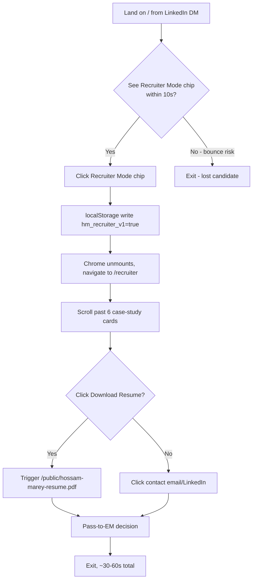
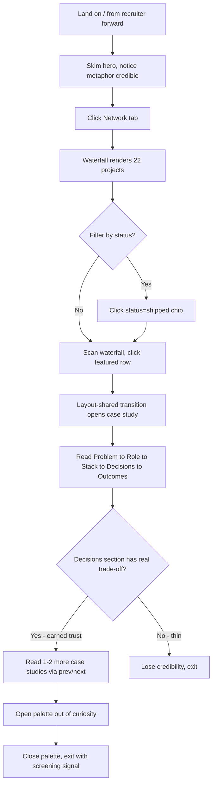
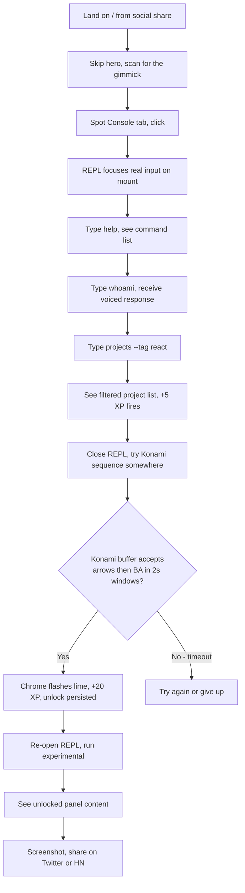

# UX Design Specification — web (devtools://hossam — Hossam Marey portfolio)

**Author:** Hossam Marey
**Facilitator:** Sally (UX Designer agent)
**Date:** 2026-05-30

> **Doc status & scope.** This spec is the **UX-decision layer** between the PRD (`prd.md` + `addendum.md`) and the upcoming Architecture phase. It is intentionally non-duplicative: where the PRD/addendum/design-system already lock a detail, this spec cross-references and adds only the UX rationale, interaction mechanics, edge cases, and architectural hooks that the architect/story-writer will need. Authority order on conflict: **`docs/design-system.md` (canonical visual) > this UX spec (interaction & flow) > PRD §5.0 voice rules > PRD FRs > `docs/plan.md` (intent only)**.

---

## Executive Summary

### Project Vision

`devtools://hossam` is a **personal resume + portfolio site that behaves like the tool senior front-end developers live in** — a browser DevTools panel with five tabs (Elements / Network / Console / Performance / Sources), persistent chrome across routes, and a "Recruiter Mode" toggle that collapses the gamification into a flat editorial resume for time-pressed recruiters.

The thesis is **demonstration over claim**: senior FE craft (interaction polish, perf discipline, a11y rigor, considered taste) shows up in the artifact itself rather than in bullet copy. The DevTools metaphor is the differentiator — recognizable to every engineer, reads as confident insider voice rather than gimmick, and rewards exploration without punishing skimmers.

### Target Users

Three personas, **strict ordinal priority** (no false numerical splits):

- **P1 — Recruiter (dominant).** Engineering recruiter at a target company, reviewing 50–200 candidates per role, 30–90s budget. Wants: clear title, current/last company, tech-stack match, downloadable resume PDF, a "is this person senior?" gut signal. **Failure mode:** finds the chrome alien and bounces before discovering the Recruiter Mode toggle.
- **P2 — Engineering Manager (substantial).** EM or Staff+ doing the deeper second look. Wants: real systems built, real trade-offs articulated, archived/failed projects flagged honestly. **Failure mode:** every case study reads as marketing summary with no decision rationale.
- **P3 — Curious Peer (long-tail).** Other senior FE devs reaching the site via word-of-mouth/conference shares. Wants: craft details — REPL personality, Konami unlock, the waterfall metaphor done right. **Failure mode:** REPL feels canned; Konami leads to a placeholder; they leave disappointed.

### Key Design Challenges

1. **Two contradictory experiences from one URL.** P1 wants editorial-Sunday-newspaper flatness; P2/P3 want exploratory DevTools playground. Recruiter Mode is the resolution mechanism but the discoverability of the toggle in ≤2 clicks (≤10s) is the load-bearing UX problem.
2. **Metaphor fidelity without misuse.** Every DevTools borrowing (tab labels, HTTP method badges, Network waterfall, Computed-styles panel, Console REPL) must look correct enough to credit and **not** read as decorative — an EM (P2) will spot post-hoc semantics in five seconds and flag the site as cute-but-shallow. The HTTP-method-as-project-type mapping is the highest-risk surface (see UX Patterns §3 below).
3. **Hierarchy under dark-only + lime-as-punctuation constraint.** With a single chromatic accent and no shadows, hierarchy must come from typography weight, hairline density, surface-elevation steps, and motion timing — not from color or depth. Every decision must hold up without those crutches.
4. **The "feel" budget vs. the feature budget.** The reconcile-plan audit flagged that every mechanical FR could be implemented and the artifact could still feel generic if the *tone* (boss-level form drama, REPL personality, Computed-styles panel-not-marquee, editorial Recruiter Mode) doesn't survive compression into FR tables. UX spec must lock the feel.

### Design Opportunities

- **The Computed-styles cell idiom** as the universal panel treatment (`bg-hairline` outer + `gap-px` + `bg-surface` children) gives every content surface a coherent DevTools-cell look without per-component restyling. This is the highest-leverage missing piece — design-system.md specifies it; PRD body misses it. UX spec promotes it to first-class pattern.
- **Recruiter Mode as a tonal pivot, not a CSS toggle.** Treating `/recruiter` as a magazine-feature layout (Stratechery / The Verge feature register) — generous line-height, single column, no DevTools metaphor — creates a memorable "calm room" that makes the rest of the site feel intentional rather than busy.
- **Validation-as-test-results** on the boss-level contact form is a one-of-one moment that lands the "this person codes" signal harder than any project list could. It earns the persona-P3 share.
- **Keyboard-first navigation** (Tab through chrome, ⌘K palette, `D` for theme, REPL is a real `<input>`, Konami buffer) tells P2/P3 "this designer respects power users" without ever stating it.

---

## Core User Experience

### Defining Experience

**Exploring the DevTools chrome.** A visitor lands on `/` (Elements tab active), sees a persistent top chrome with five tab labels matching real DevTools, and discovers — within the first interaction — that **clicking a tab swaps the panel without a full route reload**, while the URL still changes and stays shareable. The chrome's persistence is the artifact's central claim: "this is a single coherent tool, not a multi-page site dressed up." If tab-switching feels instant and the chrome doesn't flicker, the thesis lands. Everything else (REPL, palette, Konami, Recruiter Mode) is variation on this defining moment.

### Platform Strategy

- **Web only.** Next.js 16 App Router, static-first (`generateStaticParams` for case-study slugs). No native app, no PWA shell, no offline mode (Dexie dropped 2026-05-25).
- **Dark-only.** `next-themes` mounted with `defaultTheme="dark"`, `enableSystem={false}`. The `D`-key hotkey infrastructure stays for future flex, but pressing it in v1 emits a sonner "Site is dark-only. The vibe is intentional." line.
- **Keyboard-first, mouse-equal.** Every interactive surface is reachable via Tab; ⌘K opens the palette globally; the REPL is a real `<input>`; the Konami buffer skips inputs/textareas/contenteditable. Touch is supported on mobile but the desktop story is the showcase.
- **Three responsive tiers.** Mobile (`<640px`), Tablet (`640–1024px`), Desktop (`>1024px`). Mobile chrome swaps the top tab row for a bottom tab bar with `env(safe-area-inset-bottom)` — a **deliberate departure** from `docs/design-system.md` §10 which calls for `overflow-x-auto` top tabs (see Responsive §Departures).
- **RTL wired but not surfaced in v1.** Three font stacks loaded (Inter+Fraunces EN, Tajawal+Almarai AR, IBM Plex Mono); CSS vars swap on `[dir="rtl"]`. No language toggle UI in v1 — the infrastructure is there for v1.1.
- **No analytics SDK.** Vercel Web Analytics built-in only; custom-event metrics (case-study view-through, Recruiter toggle rate) are explicitly deferred to v1.1 with Plausible.

### Effortless Interactions

These must feel **zero-thought**:

- **Tab switching.** `motion/react` `AnimatePresence mode="wait"`, 0.2s in / 0.15s out, easeOut. Chrome itself never re-mounts. Route still updates; back button still works.
- **`⌘K` / `Ctrl+K` palette.** Opens from anywhere except inside a typing target. Fuzzy search across all four groups (Navigate / Projects / Actions / Socials). Result order: exact > prefix > fuzzy. Esc closes. Re-pressing the shortcut closes.
- **Theme hotkey `D`** (no modifiers, skips typing targets) — fires the dark-only toast. Infrastructure already exists in `components/theme-provider.tsx` `ThemeHotkey`; do not duplicate.
- **Recruiter Mode toggle.** Two surfaces (chrome button right of identity on `≥sm`; `⌘K` palette action under **Actions**). Both read/write `localStorage["hm_recruiter_v1"]` — single source of truth. Toggling on **unmounts** the chrome entirely (not CSS-hidden) and navigates to `/recruiter`. Toggling off returns to `/` with chrome restored.
- **REPL history.** ↑/↓ walks back/forward through prior commands. Multiline paste executes only the first line with an inline notice for the rest.

### Critical Success Moments

The moments the design **must** nail; failing any one is a launch-day defect:

1. **First tab click after landing on `/`.** If the chrome flickers, the URL "feels" like a page reload, or the panel-swap animation jerks, the persistent-chrome thesis collapses on the first interaction.
2. **P1 finds Recruiter Mode within 10 seconds.** Toggle must be visually distinct (lime border, right-of-identity), labeled "Recruiter Mode" (not an icon-only button), and the click cost must be ≤2 (button itself is enough). Failure here is the dominant bounce risk.
3. **First case study opens with a layout-shared transition.** The Network row "opens" into the detail. If the transition is missing or stuttery, the metaphor reads as flat and the EM (P2) loses the senior-craft signal.
4. **REPL `whoami` returns Hossam's actual voice, not a printout.** Tone is the test (§5.0 PRD voice rules — see Voice & Tone Lock below). If `whoami` reads like a JSON dump, P3 disengages within seconds.
5. **Contact form submit lands as "all tests green."** Validation rendered as test output (`✓ email_format`, `✓ message_length`), submit cadence dramatic but not slow (600–1200ms randomized), sonner toast formatted as system-log line. This is the showcase interaction; if it reads as a polite form with checkmarks, the "boss-level" framing dies.

### Experience Principles

Four guiding rules. When in conflict, **higher wins**:

1. **Persistence over re-rendering.** Anything inside the chrome stays mounted between route transitions. Animation, state, scroll position — they should not reset because the user clicked a tab.
2. **Quiet over busy.** Punctuation color (lime), hairline borders, surface-elevation depth, no shadows, no gradients (except hero `.bg-grid` + `.bg-scan`). Senior craft reads quiet; "too green" or "too animated" is the same failure mode.
3. **Keyboard parity.** Anything achievable with mouse must be achievable with keyboard, and discoverable through the ⌘K palette. Discoverability via hotkey hints (e.g., kbd chips in the palette) is part of the keyboard story.
4. **Tone wins ties.** When an FR conflicts with a PRD §5.0 voice rule (boss-level drama, REPL personality, editorial Recruiter Mode, Computed-styles cell idiom), **voice wins** unless there is a hard a11y or perf reason. Implementation rule mirrored from PRD §5.0.

---

## Desired Emotional Response

### Primary Emotional Goals

| Persona | Primary feeling | Trigger moments |
|---|---|---|
| **P1 (Recruiter)** | **Relief.** "I don't have to play with this; the resume is right there." | First sight of the Recruiter Mode chip in chrome → 1-click → editorial layout → Download Resume CTA visible. |
| **P2 (EM)** | **Earned trust.** "This person makes real trade-offs and writes about them honestly." | Reading a case study and finding a Decisions bullet with concrete trade-off rationale (e.g., "chose monorepo over polyrepo because…") rather than feature-list summary. |
| **P3 (Peer)** | **Delight, then desire-to-share.** "Wait, did the REPL just …?" | First `whoami` response landing in Hossam's voice; first Konami sequence triggering the lime-glow chrome pulse; first `theme light` deadpan refusal. |

### Emotional Journey Mapping

A single visitor's emotion over time, by persona:

```
P1 timeline (30–60s):
  T+0s    Curiosity ("what is this?")
  T+3s    Slight alienation ("I don't know this UI")
  T+5s    RELIEF (Recruiter Mode chip spotted, hovered)
  T+7s    Confidence (chrome unmounts, magazine layout loads)
  T+45s   Decision (Download Resume clicked)
  Exit:   Pass-to-EM decision feels easy

P2 timeline (5–10min):
  T+0s    Curiosity, mild amusement at metaphor
  T+15s   Recognition ("this is actually DevTools-shaped")
  T+45s   Network tab clicked → respect for the waterfall fidelity
  T+90s   First case study → opens with shared transition → respect deepens
  T+3min  Reads a Decisions section with a real trade-off → EARNED TRUST
  T+8min  Opens ⌘K palette out of curiosity → "considered designer" signal
  Exit:   Forwards link to a colleague with a short positive note

P3 timeline (variable, often 10–20min):
  T+0s    Skips hero, hunts for "the gimmick"
  T+10s   Console tab found → REPL is real → DELIGHT
  T+30s   `whoami` returns voice, not data → grin
  T+2min  Tries Konami sequence somewhere on the site → lime-glow chrome pulse → SCREENSHOTS
  T+5min  `experimental` command run → desire-to-share peaks
  Exit:   Tweets / Slacks the URL with a one-liner
```

### Micro-Emotions

Critical small-state pairs to engineer for:

- **Confidence vs. Confusion** — every interactive element has a focus ring (`focus-visible:ring-1 focus-visible:ring-ring`), a hover state, and a discoverable keyboard shortcut where applicable.
- **Trust vs. Skepticism** — archived/failed projects render with `archived` status (HTTP 410) honestly; mock case-study content is gated behind a CI grep that fails the launch if any v1-featured slug has `meta.mock: true`.
- **Accomplishment vs. Frustration** — XP increments visibly (when motion enabled) but never gates content. Recruiter Mode and reduced-motion both hide the XP system entirely. Form errors render as failing tests (`✗ email format — looks malformed`), not red flashes.
- **Delight vs. Satisfaction** — palette has `Toggle Theme` action that errors with the dark-only refusal; REPL `did you mean: 'projects'?` suggestion on unknown command; Konami unlock fires a single subtle lime glow, not a confetti burst. Delight is restrained.

### Design Implications

| Desired feeling | UX design move |
|---|---|
| Senior craft visible | Persistent chrome (no re-mount on route swap); layout-shared transitions on `/work` → `/work/[slug]`; reduced-motion respected on every single animation. |
| Relief (P1) | Recruiter Mode chip is the only chrome element using the lime border *outside* the active tab underline — visually pulls eye. Label is the word "Recruiter Mode," not an icon. |
| Earned trust (P2) | Case-study schema enforces Problem → Role → **Decisions** → Outcomes order. Archived projects shown with `410` pill, not hidden. `roles[]` legacy bullets preserved through migration so case studies have concrete pre-authored content. |
| Delight (P3) | REPL command outputs have voice (per §5.0 PRD). `did you mean: ...` on unknowns. Konami unlock is discoverable (REPL `experimental` lock hint + Recruiter Mode footer button for keyboard parity). |
| Quiet | No drop shadows. Max border-radius 6px. `::selection` inverted lime-on-dark. Hairline-only borders. No analytics popups, cookie banners, marketing modals — period. |

### Emotional Design Principles

1. **Restraint signals seniority.** Every "look at me" moment (loud animation, hero shader, skill bar) is a junior tell. The site uses delight as a punctuation, not a paint.
2. **Respect the busy reader.** P1's relief is more important than P3's delight. Recruiter Mode must always work first, gamification second.
3. **Voice is non-negotiable.** Per PRD §5.0: when an FR's polite default conflicts with a voice rule (boss-level drama, REPL personality, editorial Recruiter Mode), the voice rule wins.
4. **Errors are failing tests, not crashes.** Form errors, REPL unknowns, 404/500 — all render in the same DevTools-voice register. Errors are conversation, not interruption.

---

## UX Pattern Analysis & Inspiration

### Inspiring Products Analysis

| Product | What they do well (UX) | Patterns to borrow |
|---|---|---|
| **Chrome DevTools (the literal reference)** | Tab persistence; Computed-styles panel hairline-grid cells; Network waterfall column order; status pill coloring; monospace data columns; keyboard-first discoverability. | The visual idioms are the metaphor — borrow them faithfully, don't paraphrase. Network column order especially. |
| **Linear** | Keyboard-first navigation, ⌘K palette as the default action surface, motion as functional feedback (not decoration), hairline-only borders, tight monospace data tables. | Palette grouping (Navigate / Projects / Actions / Socials); spring-based subtle feedback motion; "kbd chip" hint visibility. |
| **Raycast** | Command palette as primary interaction; fuzzy search ranking; real-time keyboard hints visible inline. | Palette result-ranking algorithm (exact > prefix > fuzzy); kbd chip rendering style. |
| **Stripe Docs** | Editorial typography for long-form reading; sticky sidebar nav; clean code-block treatment; restrained color usage. | Editorial Recruiter Mode (`/recruiter`) tonal direction — typography-led, single column, no UI chrome. |
| **Vercel Dashboard** | Score rings borrowing from Lighthouse; dark-mode-native palette; subtle motion on data viz; hairline data tables. | Performance route score-ring treatment; page-weight budget viz. |

### Transferable UX Patterns

**Navigation patterns:**

- **Tab-as-route with persistent chrome** (Chrome DevTools, VS Code editor groups) — every tab is a real URL but the frame around the content doesn't re-render. Use for the 5 main tabs.
- **Command palette as universal action surface** (Linear, Raycast, GitHub) — ⌘K opens a fuzzy-search overlay grouping all possible navigations, actions, and entities. Use for the ⌘K palette with 4 groups.
- **Layout-shared transitions for list → detail** (iOS, modern web with `motion/react` `layoutId`) — clicking a row "opens" into the detail view with continuity. Use for `/work` row → `/work/[slug]` case study.

**Interaction patterns:**

- **Real REPL with command registry** (developer-CLI muscle memory) — every command parses with a tiny CLI grammar, supports flags (`projects --tag react`), history walks via ↑/↓, unknown commands suggest nearest valid one.
- **Inline form validation as passing test output** (CI dashboards, Jest reporters) — `✓ email format`, `✗ message_length: 12 < 20`. Showcase pattern for `/sources contact.ts`.
- **Hairline-grid panels** (DevTools Computed tab) — `bg-hairline` + `gap-px` + `bg-surface` children produces the signature inset-grid look without per-cell borders. **Universal panel treatment**; missing from PRD body, promoted to first-class here.

**Visual patterns:**

- **Score rings for at-a-glance metrics** (Lighthouse, Apple Watch activity) — circular progress with central number, supports easy comparison across 3–4 metrics in a row.
- **Network waterfall** (Chrome DevTools Network tab) — fixed left columns (method/name/type/status/size/time) + horizontal bar position+width visualization on the right. Bars use `transform: scaleX()` only (perf rule).
- **`::selection` inverted accent** (some technical docs sites, terminal apps) — highlighting text inverts to lime background / dark foreground; "the site is selecting *you*."

### Anti-Patterns to Avoid

- **Skill bars / percentages.** Universally read as junior by senior reviewers. PRD §3 P2 explicit "does not want." Skills matrix in Recruiter Mode is a flat 3-column list, no fill percentages.
- **Hero shader / Three.js / WebGL gimmick.** Off-brand (quiet competence) and breaks the perf budget. Hard "no" per addendum §3.4.
- **Carousels for case studies.** Auto-rotating content punishes both readers (loses position) and a11y (focus management nightmare). Network waterfall is the index; case studies are individual routes.
- **Cookie banners / GDPR modals.** Vercel Analytics is cookie-less; no consent needed.
- **Tutorial overlay on first visit.** OQ6 in PRD — leaning toward **no**. Discoverability through chrome labels + ⌘K palette is sufficient; an overlay reads as "designer didn't trust the UI."
- **Animated marquee of brand logos.** Generic agency aesthetic; doesn't fit DevTools register. Stack marquee on `/` is the *only* marquee, and it pauses on hover and falls back to static grid under `prefers-reduced-motion`.
- **"Passionate developer" copy / emoji-heavy bios.** PRD §3 P2 explicit anti-pattern.

### Design Inspiration Strategy

**Adopt verbatim:** Chrome DevTools panel idioms (Computed-styles cells, Network waterfall columns, status pills); Linear's palette grouping; Stripe Docs' editorial register for `/recruiter`.

**Adapt:** Lighthouse score rings (custom number-count animation, ring-draw on `useInView`); Raycast palette ranking (exact > prefix > fuzzy); Linear-style kbd chip hints.

**Avoid:** All listed anti-patterns above; any "Hello, I'm Hossam!" hero on `/recruiter`; any animation that doesn't gate on `prefers-reduced-motion`.

---

## Design System Foundation

### Design System Choice

**Themeable: shadcn 4.8.0 (`radix-nova` preset, `neutral` base) on Tailwind v4.2.1**, with project-specific OKLCH tokens layered via `@theme inline { … }` in `app/globals.css`. Radix primitives provide the a11y backbone (keyboard nav, ARIA, focus management); shadcn provides the vendored, project-owned component layer; the OKLCH token system provides the Obsidian + Signal Lime visual identity.

This choice is **locked at the codebase level** (already installed, 22 primitives vendored) and ratified by PRD NFR-O5. The UX spec confirms it without re-litigation.

### Rationale for Selection

- **Speed.** 22 shadcn primitives already vendored (button, card, dialog, dropdown-menu, input, textarea, label, popover, select, separator, switch, tabs, sonner, tooltip, badge, sheet, input-group, command, calendar, …). Reuse-first policy reduces the surface area of custom components to just the metaphor-bearing ones.
- **Customization without lock-in.** shadcn's vendor-the-code approach means there's no library API to fight. Every primitive is owned source under `components/ui/*` and can be re-styled with project tokens directly.
- **A11y via Radix.** Keyboard nav, focus rings, ARIA wiring are correct out of the box. The site's WCAG 2.1 AA goal (NFR-A1) is materially easier to hit with this foundation than with a hand-rolled component layer.
- **Token system independence.** Tailwind v4's `@theme inline` lets us define our OKLCH palette without a `tailwind.config.*` file (none exists in v4). Tokens live in `app/globals.css` as the single source of truth, swapped for `[dir="rtl"]` only where needed.

### Implementation Approach

| Layer | Source | Owns |
|---|---|---|
| **Tokens** | `app/globals.css` `@theme inline` | Colors (OKLCH), typography stack, spacing scale, `--radius`, motion timings. Source-of-truth: `docs/design-system.md` §2–§5; canonical values inlined in addendum §0. |
| **Primitives** | `components/ui/*` (vendored shadcn) | Button, Card, Dialog, Input, Tabs, Tooltip, Badge, Sheet, Command, Sonner, …. Reuse-first. |
| **Custom components** | `components/*` (project-specific) | DevTools chrome, Network waterfall, Console REPL, Score rings, Boss-level form, XP bar, Konami listener, Computed-styles panel wrapper. See Component Strategy §below. |
| **Variants** | `cva` calls inside each component | Variant prop API; Prettier sorts classes inside `cva()` and `cn()`. |
| **Motion** | `motion/react` (v12 entry — `motion/react`, NOT `framer-motion`) | All animations, gated by `useReducedMotion()` or duration-collapse to `0.001s`. |

### Customization Strategy

- **Token overrides only via `app/globals.css`**, never via Tailwind config (v4 doesn't use one). All color, type, spacing, and radius changes happen in one file.
- **shadcn primitives are vendored, not imported.** Restyle by editing `components/ui/*` source directly — semantic tokens (`bg-background`, `text-foreground`, `border-border`, `bg-primary`) carry the palette automatically.
- **Custom components compose primitives.** A `<NetworkWaterfallRow>` is built from `<Badge>` (method/status) + custom layout + `motion/div` (bar). No bespoke styling primitives.
- **No parallel UI library.** Adding any second component layer (Headless UI, Mantine, MUI, custom design-system fork) requires explicit approval. NFR-O5 enforced.

---

## 2. Core User Experience (Defining Experience)

### 2.1 Defining Experience

**Click a tab. The panel changes. The chrome doesn't.**

That is the central UX claim of `devtools://hossam`. Every other feature (REPL, palette, Konami, XP, Recruiter Mode, case studies) is downstream of this single interaction working — and feeling — as advertised.

Users describing the site to a friend should say something like: *"It's set up like Chrome DevTools — you click between Elements, Network, Console — and each one is actually a real page with the resume content shaped like that DevTools panel."* If that one-sentence retelling is achievable in 10 seconds, the defining experience landed.

### 2.2 User Mental Model

- **Every engineer already has DevTools in muscle memory.** Tab metaphor needs zero teaching. F12 reflex.
- **Recruiters do not have DevTools in muscle memory.** The chrome reads as "an app they don't know" — which is exactly why Recruiter Mode exists. The toggle is the escape hatch that converts P1 confusion into P1 relief in one click.
- **The HTTP method badges (`GET`/`POST`/`PUT`/`PATCH`) are a **decorative metaphor**, not semantic typing.** This is a known UX risk (review-rubric.md flagged it). Mitigation: badges live inside the Network metaphor frame where the joke is contextualized; tooltip on hover surfaces the metaphor explanation; reviewer thought-process of "that's not what HTTP methods mean" is the *intended* reading per FR-021.
- **The REPL is a real `<input>`, not a fake terminal.** Users can paste, copy-out, screen-read, and use it on touch keyboards. The mental model of "this is a real shell" must be preserved; no fake blinking cursor div that breaks selection.

### 2.3 Success Criteria

Measurable signals the defining experience is working:

- **Tab switch latency.** <100ms input-to-paint (NFR-P2). User clicks tab → panel content visibly changes in under 100ms. Spinner or skeleton is a failure.
- **Chrome stability.** Identity strip + tab row + XP bar (when visible) do not flicker, re-mount, or shift layout between tab clicks. Inspector test: chrome elements retain DOM identity across route transitions inside the `(chrome)` route group.
- **URL fidelity.** Tab clicks update `window.location.pathname`. Back-button returns to prior tab. Deep-linking to any tab works.
- **No console errors / warnings.** First-visit, theme-toggle (no-op), tab-switch, RTL flip — all four flows produce zero noise in DevTools console.

### 2.4 Novel vs. Established Patterns

| Pattern | Established or novel? | Notes |
|---|---|---|
| Tab nav with persistent chrome | Established (DevTools, VS Code editor groups, browser tabs) | No teaching cost. |
| `⌘K` palette | Established (Linear, Raycast, GitHub, Slack, VS Code Cmd-Shift-P) | No teaching cost. |
| HTTP method badges on portfolio projects | **Novel-as-metaphor** | Risk surface; mitigation via tooltip + frame context. |
| Network waterfall for project list | **Novel-as-metaphor** | Familiar visualization in unfamiliar domain. EM (P2) reads it as "clever," recruiter (P1) reads it as "weird" → mitigated by Recruiter Mode. |
| Console REPL on a personal site | **Novel** | Hidden behind a tab the user must click; voice rules ensure payoff. |
| Konami code unlock | **Established easter egg pattern** | Discoverable via Recruiter Mode footer button (parity) per FR-083. |
| Recruiter Mode total UI swap | **Novel-ish** (some "lite mode" patterns exist) | Two-click reach; chrome unmounts, not CSS-hidden. |
| Boss-level form with test-output validation | **Novel** | Voice rule load-bearing; teaching cost = zero because users discover it after deciding to send a message. |

### 2.5 Experience Mechanics

The defining interaction (tab switch) broken into stages:

1. **Initiation.** User clicks any of the 5 DevTools tabs in the chrome (`<nav>` with role="tablist" semantically; visual underline on active). Keyboard equivalent: Tab to tab row → ↵ / Space. ⌘K → "Navigate" group → Elements/Network/Console/Performance/Sources also works.
2. **Interaction.** Click fires Next.js client-side route change (`<Link>` from `next/link`). Route change resolves within the `(chrome)` route group — so the layout (chrome) does not re-mount, only the page content does. `motion/react` `<AnimatePresence mode="wait">` wraps the page content slot.
3. **Feedback.**
   - **Active tab.** Underline (`border-b-2 border-lime`) updates immediately on `usePathname()` change.
   - **Panel transition.** Old panel fades out (0.15s, easeOut). New panel fades in (0.2s, easeOut). Direction is purely opacity; no slide.
   - **XP bar increment.** On first visit to a tab in the current session, +10 XP fires via `CustomEvent("hm:xp", {detail: {delta: 10, reason: "visit:network"}})`. Spring animation on width.
   - **Reduced motion.** All of the above collapses to instant swap (no fade, no spring). XP still increments silently; no toast.
4. **Completion.** New panel content is interactive (focusable, scrollable, mouse-hover-able) within 100ms of tab click. URL bar shows new pathname. Browser back button restores prior tab + panel state.

**Edge cases the architect must handle:**

- **Tab click during in-flight transition.** Cancel the in-flight transition, start the new one. `AnimatePresence mode="wait"` handles this — verify under stress.
- **Hard refresh of any tab.** All routes statically rendered; first paint shows the chrome + content with no JS required. Hydration kicks in for interactive elements (palette, REPL, XP bar).
- **Deep link with active filter.** `/work?status=shipped&method=GET` — filter state persists in search params, rehydrates filter chips on hard load.
- **Tab switch with active XP toast.** Toast continues its animation; doesn't get cut off by route change (toast is in a portal under root `<body>`, not under the page slot).

---

## Visual Design Foundation

### Color System

**Canonical source:** `docs/design-system.md` §2. **Authoritative inlined values:** `addendum.md` §0.1. UX spec does not re-list values; the architect implements directly from the addendum table.

Critical UX-level rules layered on top:

1. **Lime is a punctuation color.** Use for: primary CTA, active tab underline, XP bar fill, focus ring, palette highlight, `::selection`, brand accent moments. **Never** for body copy or large filled surfaces. If a section reads "too green," it is too green.
2. **Status semantic mapping is contract.** `200 shipped` → `--status-ok`; `201 ongoing` → `--status-warn`; `410 archived` → `--status-err`. Architect must enforce this via the typed `Project.statusCode` enum (`200 | 201 | 410`) — see Component Strategy.
3. **No light mode anywhere.** `:root` carries the dark palette as defaults; **no light variants in `app/globals.css`**. The print stylesheet for `/recruiter` (`@media print`) is the only place a light color system exists (addendum §6).
4. **Charts use the chart token set.** `--chart-1` (lime) through `--chart-5` (purple) for /perf score rings, waterfall method tinting, and any future data viz. Never hardcode hex/oklch in components.
5. **`::selection` is inverted lime.** `::selection { background: var(--lime); color: var(--lime-foreground); }` — promoted from missing-in-PRD to load-bearing aesthetic.

### Typography System

**Canonical source:** `docs/design-system.md` §3 ✱with a known contradiction now resolved✱.

**Resolution of the typography contradiction** (flagged in reconcile-design-system §2):

- **Body sans:** **Inter** (Variable), weights 400–600. *(Spec wins; PRD's "Inter Tight" mention superseded.)* Rationale: Fraunces pairs naturally with Inter, not Inter Tight; Inter is the design-system canonical; Inter Tight is a tighter-default-tracking variant that drops the serif-sans contrast the spec wants.
- **Display serif (titles):** **Fraunces** (Variable), weights 400–600. Hero H1 (`clamp(2rem, 10vw, 6rem)`, `leading-[0.95]`, `tracking-tight`) uses Fraunces. Section H2 stays Inter. *(Fraunces was missing from PRD body; restored here.)*
- **Mono (code/labels/REPL/data):** **IBM Plex Mono**, weights 400–500.
- **Font features:** `font-feature-settings: "ss01" on, "cv11" on` globally on `html, body`. *(Missing from PRD; restored here.)*
- **Arabic stacks (RTL):** Tajawal (sans) + Almarai (display). CSS vars swap on `[dir="rtl"]`. No language UI in v1 but the wiring is correct.

**Type scale (Tailwind utilities, applied per component, not tokenized):**

| Role | Utility | Notes |
|---|---|---|
| Hero H1 | `text-[clamp(2rem,10vw,6rem)] font-semibold leading-[0.95] tracking-tight font-title` | Fraunces |
| Section H2 | `text-2xl sm:text-3xl font-semibold` | Inter |
| Body | `text-sm sm:text-base text-foreground/90` | Inter |
| Mono label | `font-mono text-[10px] sm:text-[11px] uppercase tracking-wider text-muted-foreground` | IBM Plex Mono |
| Mono data (waterfall, REPL) | `font-mono text-sm` | IBM Plex Mono |
| Tab text | `font-mono text-xs uppercase tracking-wider` | IBM Plex Mono — DevTools-tab feel |
| `<kbd>` | `rounded border border-hairline px-1.5 py-0.5 font-mono text-[10px]` | For ⌘K hints, REPL help |

### Spacing & Layout Foundation

- **Container:** `max-w-6xl mx-auto px-4` on mobile, scaled paddings on desktop. Recruiter Mode uses `max-w-3xl` for editorial readability.
- **Grid:** Single column default; `sm:grid-cols-2` for principles/metrics; `md:` for data tables and sidebar layouts (220px sidebar + `1fr` content); `lg:grid-cols-4` for score rings.
- **Gap scale:** Between major sections `mt-10` to `mt-12`. Between related items `gap-2` to `gap-3`. Card padding `p-6` (mobile) → `sm:p-8`.
- **Border radius:** `--radius: 0.375rem` (6px) **maximum**. `rounded-sm` (~2px) for small UI; `rounded` for buttons; occasionally `rounded-md`. **Never** `rounded-lg`, `rounded-xl`, `rounded-full` *except* the XP bar pill in chrome. (Restored from missing-in-PRD.)
- **Borders:** `border-hairline` is the **default** for every divider, card edge, panel boundary. No `border-2`, no `border-b` between rows (use the Computed-styles cell idiom instead). No drop shadows.
- **Hero background:** `.bg-grid` (48px lines @ 4% white) + `.bg-scan` (4px scanlines @ 2% white), `opacity-40` / `opacity-60` composited. Dark-only utility; defined in `@layer utilities`.

### Accessibility Considerations

Visual-layer a11y rules (interaction-layer rules in Responsive & A11y §below):

- **Lime-on-Obsidian only for large text (≥18pt, or ≥14pt bold) or icons.** Never body copy. WCAG AA contrast minimum 4.5:1 for normal text — lime body would fail.
- **Focus rings visible on every interactive element.** `focus-visible:ring-1 focus-visible:ring-ring` from shadcn defaults. Lime ring color (`--ring: var(--lime)`).
- **Status colors meet AA against `--surface`.** `--status-ok`, `--status-warn`, `--status-err` chosen for OKLCH lightness 0.7–0.85 to maintain readable contrast on surface backgrounds.
- **`alt` on every ``** (empty `alt=""` for decorative); `next/image` always, never bare ``.

---

## Design Direction Decision

### Design Directions Explored

The visual direction is **locked** at the canonical-design-system level (Obsidian + Signal Lime, dark-only, DevTools metaphor). Generating 6-8 alternate visual mockups (the default workflow step) would re-litigate a settled decision and waste the work already captured in `docs/design-system.md` + `app/globals.css` (post-rewrite per Resolved Decision 1, 2026-05-25).

Instead, this section **documents the chosen direction** and the alternate directions that were considered and rejected during pre-PRD ideation, with rationale for each rejection. (HTML showcase deliberately skipped; the live build is the showcase.)

| Direction | Description | Verdict |
|---|---|---|
| **V1 — Obsidian + Signal Lime, dark-only, DevTools metaphor** (chosen) | Dark base (`oklch(0.155 0.012 260)`), single lime accent (`oklch(0.92 0.21 125)`), IBM Plex Mono / Inter / Fraunces stack, hairline borders only, Computed-styles cell panel idiom universal. | **CHOSEN.** Carries the thesis (senior FE craft = restraint + precision). Survives the recruiter-distaste test via Recruiter Mode. |
| V2 — Warm editorial (cream `#fbf6ef` + terracotta `#c64a2b`) | Old palette from initial template; magazine-feel, light-mode-primary. | Rejected. Reads as agency/magazine site, not technical artifact. Doesn't carry the DevTools metaphor (DevTools is never warm). |
| V3 — Brutalist mono (pure black + pure white + monospace everywhere) | Severe, high-contrast, zero accent color. | Rejected. Reads as trendy brutalism, dates immediately, no warmth/play. Misses delight register for P3. |
| V4 — Glass-morphism / aurora gradient | Backdrop-blur surfaces, soft gradient accent. | Rejected. Heavy GPU cost (breaks Lighthouse budget); aesthetically opposite of DevTools register; "look at me" effect. |
| V5 — Solarized-style technical | Borrowing from Solarized Dark; brown-accent terminal look. | Rejected. Too close to dotfile-config aesthetic; lacks distinct identity; lime is sharper and more memorable. |

### Chosen Direction

**V1 — locked.** Every downstream decision (typography, component patterns, motion timing, responsive behavior) flows from this. Architect implements per `docs/design-system.md` §2–§11 and `addendum.md` §0.

### Design Rationale

- **Carries the thesis.** DevTools is dark; Obsidian + Signal Lime *is* DevTools. The metaphor would feel forced under any other palette.
- **Survives the recruiter test.** Dark-only is alienating to some P1 visitors → Recruiter Mode is the mitigation. The mitigation works (1-click escape) precisely because the chrome's distinctness signals "click me to escape this UI."
- **Restraint is the brand.** Punctuation-color usage (lime) demonstrates taste in a way no "passionate about clean code" bio can. The visual system is the artifact's primary credibility play for P3.
- **Implementation cost is bounded.** No light mode to design in parallel (except a tiny print stylesheet). One color decision, one type decision, one motion decision per surface.

### Implementation Approach

| Concern | Owner | Reference |
|---|---|---|
| Token authoring | `app/globals.css` rewrite | Addendum §0.1, §0.2 |
| Computed-styles cell pattern | Custom `<Panel>` wrapper component | Addendum §0.3 item #3 |
| Hero `.bg-grid` + `.bg-scan` | `@layer utilities` in globals.css | Addendum §0.1 |
| `::selection` styling | `@layer base` in globals.css | Addendum §0.1 |
| Print stylesheet for `/recruiter` | `app/recruiter/print.css` or `@media print` block | Addendum §6 |

---

## User Journey Flows

### Foundation

Three user journeys from PRD §4.5 (UJ-1, UJ-2, UJ-3) are the source of truth for *who* and *why*. This section designs the *how* — the step-by-step interaction mechanics, decision points, error paths, and architectural triggers each journey requires.

### UJ-1 — Recruiter 30-second scan (P1)



**Architectural triggers UJ-1 imposes:**

- Recruiter Mode chip must be in chrome at `≥sm` breakpoint, lime-bordered (the only chrome element using lime border outside active tab) for visual eye-pull.
- `localStorage["hm_recruiter_v1"]` is the single source of truth — both the chip and the ⌘K palette action read/write it.
- `/recruiter` is a real route (outside the `(chrome)` route group), not a CSS hide. Chrome literally unmounts.
- On mobile (`<sm`), the chip is hidden in chrome — `/recruiter` toggle exposed via the ⌘K palette only. **Risk:** mobile recruiters lose the visual chip. **Mitigation:** mobile bottom tab bar includes a "Recruiter" tab label (re-using one of the 5 tab slots? — TBD with architect; could also be a hamburger menu item).

**Failure modes designed for:**

- **Toggle invisible.** Chip placement (right-of-identity-strip) and lime-border styling must survive design QA. Eye-tracking proxy: in P1 user-testing-equivalent (sharing with 3 trusted recruiter contacts), confirm "Recruiter Mode" is the first chrome word they read after the name.
- **Toggle works, layout broken.** `/recruiter` must hit Lighthouse 95+ in its own right. Skills matrix doesn't shift, photo (if any) doesn't squash, Download Resume CTA is one click from the top.
- **PDF doesn't download.** File must exist at `/public/hossam-marey-resume.pdf` (v1) — pre-launch CI gate verifies file presence.

### UJ-2 — EM case-study deep dive (P2)



**Architectural triggers UJ-2 imposes:**

- Layout-shared transition on row → detail (`motion/react` `layoutId="project-<slug>"` on the row card and the case-study header).
- Case-study layout enforces Problem → Role → Stack → Decisions → Outcomes → Links order (via the page component, not just convention).
- Filter chips persist to URL search params (`?status=shipped&method=GET`) for shareable filtered views per FR-026.
- Prev/next pager at footer of `/work/[slug]` walks projects in declaration order in `lib/content/projects.ts`. **Order matters** — Hossam controls which case studies are adjacent for narrative flow.

**Failure modes designed for:**

- **Empty filter result.** "No requests match your filter" with a "Clear filters" button (FR-027).
- **Case study with `meta.mock: true` at launch.** CI gate fails the build (addendum §5). UX-level: any mock case study renders a dev-only `console.warn` and a subtle `[MOCK]` badge in non-prod builds so reviewers know.
- **Layout-shared transition stutter under reduced motion.** Reduced motion swaps the transition for an instant fade (`duration: 0.001`). Acceptable; the row→detail meaning is carried by the URL change and breadcrumb.

### UJ-3 — Peer Console + Konami exploration (P3)



**Architectural triggers UJ-3 imposes:**

- REPL input must auto-focus on `/console` mount (visible cursor in input). On mobile, focus triggers the touch keyboard — acceptable; users on mobile/console is a niche path.
- Konami sequence buffer (`↑↑↓↓←→←→BA`, case-insensitive on letters, 2s timeout between keys) is global (mounted in root layout) but **skips typing targets** (`<input>`, `<textarea>`, `[contenteditable="true"]`) per FR-081 and the existing `ThemeHotkey` pattern.
- Unlock writes to `localStorage["hm_unlocks_v1"]` (array), fires chrome lime-pulse animation (one-shot, 800ms, reduced-motion respects), adds `experimental` to REPL help output, adds "Experimental" entry to ⌘K palette under Actions.
- Recruiter Mode footer includes a "🎮 Show experimental" button (FR-083) so the unlock has a keyboard-discoverable equivalent.

**Failure modes designed for:**

- **Konami buffer fires inside a typed input.** Excluded by typing-target check; identical pattern to `ThemeHotkey` (`D`-key) excludes typing — reuse the same helper.
- **`experimental` reveals placeholder content.** OQ3 still open; current `[ASSUMPTION]` is "what I'm building next" panel. **UX requirement:** ship with real content (one project Hossam is exploring) or don't ship the unlock at all. Placeholder breaks the P3 share moment.
- **Unlock not persistent.** Konami writes `"konami"` into the `hm_unlocks_v1` array. On reload, palette + REPL both check the array. localStorage degradation (private mode etc.) → in-memory fallback; user re-Konamis on next visit, accepted edge case.

### Cross-Journey Patterns

Patterns reusable across all three journeys:

- **`localStorage` mode bus.** Three persisted keys (`hm_recruiter_v1`, `hm_xp_v1`, `hm_unlocks_v1`) — every UI surface that depends on them reads via a single hook (`useRecruiterMode`, `useXP`, `useUnlocks`) so consistency is structural.
- **Custom-event XP bus.** `window.dispatchEvent(new CustomEvent("hm:xp", {detail: {delta, reason}}))` — every XP-granting action emits this; XP store consumes via `addEventListener("hm:xp")`. **No state-management library** (FR-078).
- **Reduced-motion gate.** Every animation passes through `useReducedMotion()` from `motion/react`. Single helper hook reused across the codebase — no per-component re-implementation.
- **Keyboard-skip helper.** Every global hotkey (D, ⌘K, Konami sequence) checks the active element against the typing-target set before firing.

### Flow Optimization Principles

1. **Steps to value ≤2 for P1.** Landing → Recruiter Mode chip → editorial layout. PDF is one further click but the layout is the success state.
2. **Layout-shared transitions for list→detail** (UJ-2). Continuity costs nothing under reduced motion (instant fade) but earns trust under motion-on.
3. **Voice-rich error paths.** Form errors, REPL unknowns, filter empty states — all stay in DevTools register (test-output style, `did you mean:`, etc.). Errors are conversation.
4. **URL is the canonical state.** Filters, active tab, Recruiter Mode (via initial route `/recruiter` if persisted) — sharable, hard-refresh-safe.

---

## Component Strategy

### Design System Components (reuse-first)

22 shadcn primitives already vendored in `components/ui/*`. Use these before authoring custom:

| Primitive | Used in | Notes |
|---|---|---|
| `<Button>` | CTAs, palette actions, Recruiter footer Konami button, Download Resume | Variants: `default` (lime fill), `outline` (hairline), `ghost` (no border). |
| `<Card>` | Recruiter Mode case-study cards | Hairline only, no shadow override needed. |
| `<Badge>` | Method badge, status pill, stack chips | `cva` variants by status/method color. |
| `<Tabs>` | NOT used for main nav (chrome is bespoke); used inside case studies if multi-section detail needed | Reserved. |
| `<Dialog>`, `<Sheet>` | None in v1 (no modals; palette is its own component) | Available for v1.1. |
| `<DropdownMenu>`, `<Popover>` | Filter chip multi-select on `/work` | Pattern: chip → popover with checkboxes. |
| `<Input>`, `<Textarea>`, `<Label>` | Boss-level contact form fields | Re-styled to `bg-input` (darker than surface), `font-mono`, focus border lime. |
| `<Select>` | Possibly filter chips (TBD) | Likely replaced by popover-with-checkboxes for multi-select. |
| `<Switch>` | Recruiter Mode toggle in chrome (visual)? — OR a plain button? | Decision: **button**, not switch — "Recruiter Mode" reads better as an action button than a toggle widget. |
| `<Tooltip>` | Method-badge metaphor explanation, kbd hint tooltips | Restrained use. |
| `<Sonner>` (toast) | XP toast, theme-toggle dark-only refusal, contact submit success | Single Sonner provider in root layout. |
| `<Separator>` | Visual dividers inside panels | Hairline. |
| `<Command>` (cmdk) | ⌘K palette | Used directly via shadcn `<CommandDialog>`. |
| `<Calendar>`, `<InputGroup>` | Not used in v1 | Reserved. |

### Custom Components

Components not covered by shadcn primitives. Specs are UX-level (purpose, states, a11y) — architect translates to props/types.

#### `<DevToolsChrome>` (root layout component)

- **Purpose.** Persistent UI frame mounted in `app/(chrome)/layout.tsx`. Wraps every non-`/recruiter` route.
- **Anatomy.** Identity strip (top): name + role left, Recruiter Mode chip + XP bar right. Tab nav row (desktop): 5 tab labels with active-underline. Mobile bottom tab bar replaces tab nav row (see Responsive §). XP bar may live in identity strip or as a thin lime line at the very top of viewport — architect call; design-system spec says inside identity strip area.
- **States.** No props-driven visual states; reactive to `usePathname()` (active tab), `useReducedMotion()` (animation gating), `useRecruiterMode()` (would unmount but since `/recruiter` is outside the chrome route group, this never fires inside chrome — defense-in-depth check only).
- **Variants.** Desktop, Mobile. Single component renders both via responsive utilities; no separate `<MobileChrome>`.
- **Accessibility.** `<header>` for identity strip, `<nav aria-label="DevTools tabs">` for tab row. Active tab marked with `aria-current="page"`. Tabs are real `<Link>`s — keyboard Tab moves focus, Enter activates.
- **Content guidelines.** Identity strip is `Profile.name` + `Profile.role`. No tagline here (tagline lives in `/` hero). Recruiter chip is the literal text "Recruiter Mode."
- **Interaction behavior.** Tab click → Next.js client route change. Chip click → write `hm_recruiter_v1=true`, navigate to `/recruiter`.

#### `<NetworkWaterfallTable>` + `<NetworkWaterfallRow>`

- **Purpose.** Render `Project[]` as a DevTools Network panel. Desktop grid (`grid-cols-[60px_1.4fr_0.9fr_90px_90px_90px_1.4fr]`); mobile card with method+name+status row + bar.
- **Anatomy.** Header row (uppercase mono labels). Body rows (method badge, name, type, status pill, size label, time label, waterfall bar). Empty state ("No requests match your filter" + Clear).
- **States.** Default; hovering a row (subtle bg-surface-2 elevation); active filter chips above table; empty filter; loading (not used in v1 — all data is static at build).
- **Variants.** Desktop grid; mobile card stack.
- **Accessibility.** `<table>` with `<thead>`/`<tbody>` semantically (or ARIA grid if grid layout chosen — architect call). Each row is a `<tr>` containing a `<Link>` to `/work/[slug]` — entire row clickable but visible link wraps the name cell for screen-reader clarity. Status pills include `aria-label` ("Status: shipped, 200").
- **Content guidelines.** Waterfall bar uses `transform: scaleX(timeWeight)` + `transform: translateX(startOffset)`. Never `width`. Bar color derived from `method` via chart token.
- **Interaction behavior.** Row hover → bg lifts to `--surface-2`, cursor pointer. Click → layout-shared transition to detail. Filter chips → URL search-param update + re-filter client-side (no re-fetch; data is static).

#### `<NetworkRequestDetail>` (case-study page)

- **Purpose.** Render a single `Project` as a DevTools Network request detail. Used at `/work/[slug]`.
- **Anatomy.** Breadcrumb (`Network > [project name]`); section blocks Problem → Role → Stack (chip row) → Decisions (bullets) → Outcomes (bullets, ideally with before/after numbers) → Links (filtered live/code/design). Prev/next pager at footer.
- **States.** Default; mock badge variant (if `meta.mock: true`, render a dev-only `[MOCK]` badge in non-prod builds); link-missing fallback (filter null links out).
- **Variants.** None visual; content schema-driven.
- **Accessibility.** `<article>` root. Single `<h1>` per page (`Project.name`). Each section is `<section>` with an `<h2>`. Breadcrumb is `<nav aria-label="Breadcrumb">` with JSON-LD `BreadcrumbList`.
- **Content guidelines.** Stack chips inherit from the chip pattern (mono, hairline). Decisions and Outcomes are unordered lists. Links rendered as outline buttons with iconography (live, code, design).

#### `<ConsoleREPL>`

- **Purpose.** Real `<input>`-backed REPL with command registry, history buffer, voiced outputs. At `/console`.
- **Anatomy.** Output scroll area (mono, line-wrapped); input row with prompt prefix (`λ ` or `> `) and `<input>` (no border, mono, lime caret).
- **States.** Idle (cursor blink — CSS only, not JS); processing a command (300ms max — most are sync); history navigation (↑/↓ replaces input value); unknown command (renders `command not found: <x>. Type 'help' for available commands.` with `did you mean: <suggestion>?` if close match).
- **Variants.** None; one REPL.
- **Accessibility.** Real `<input>` (not contenteditable). `aria-label="Console input"`. Output area `aria-live="polite"` so screen readers announce new lines. ↑/↓ keys handled on the input only (don't conflict with global navigation).
- **Content guidelines.** Every command output is in Hossam's voice (§5.0 PRD). No Lorem placeholders ship.
- **Interaction behavior.** Enter submits command, command parsed by tiny registry (no shell library), output appended, input cleared. Multiline paste: first line executes, rest renders as a notice. `clear` resets the output buffer (history persists). Each successful command grants +5 XP.

#### `<ScoreRing>` (Performance route)

- **Purpose.** Lighthouse-style circular metric. Used in `/perf` for years shipped, projects, talks, mentees.
- **Anatomy.** SVG circle (background ring at low opacity, fill ring drawn from 0 to target), centered number with count-up animation, label below.
- **States.** Pre-view (number = 0, fill = 0); in-view animating (ring draws 0→target over 1.1s easeOut; number counts up via rAF over 1100ms cubic-ease-out); settled.
- **Variants.** Color per metric (use chart tokens). Size (default + small).
- **Accessibility.** `aria-label="[label]: [value][suffix]"` on the wrapper. Decorative SVG (`aria-hidden="true"` on the ring elements; the wrapper carries the meaning).
- **Content guidelines.** If a metric is 0 (e.g., zero mentees), **omit the ring entirely** — don't render an empty ring. Per FR-050.
- **Interaction behavior.** `useInView({ once: true })` triggers the draw + count-up. Reduced motion: ring renders fully drawn at mount, number renders final value immediately.

#### `<PageWeightBudget>` (Performance route sub-component)

- **Purpose.** Stacked horizontal bar showing actual bundle composition (HTML / JS / CSS / images / fonts) at build time. Embedded as static JSON.
- **Anatomy.** Horizontal bar with labeled segments. Legend below.
- **States.** Default; on `whileInView` segments draw their width.
- **Variants.** None.
- **Accessibility.** `<dl>` semantically with each segment as `<dt>`/`<dd>` pair so screen readers get name + size.
- **Interaction behavior.** None (display only).

#### `<FileTree>` + `<FilePreviewPane>` (Sources route)

- **Purpose.** Left pane file tree, right pane preview. At `/sources`.
- **Anatomy.** Left: tree entries (`resume.pdf`, `articles/`, `talks/`, `contact.ts`). Right: preview of selected file.
- **States.** Default; selected entry (lime border-left); empty preview (initial mount before user selects).
- **Variants.** Desktop two-pane; mobile single-pane stack (tree above, preview below).
- **Accessibility.** Tree is `<nav aria-label="Sources file tree">` with `<ul>`/`<li>` and `aria-selected` on the active entry. Keyboard ↑/↓ navigates entries; ↵ selects.
- **Interaction behavior.** Click entry → URL hash updates (`/sources#contact.ts`); preview re-renders. `articles/`, `talks/` are placeholders ("Coming soon" content) per FR-060 + A10.

#### `<BossLevelContactForm>`

- **Purpose.** Showcase contact form rendered as a typed-terminal boss fight. Lives at `/sources` when `contact.ts` is selected.
- **Anatomy.** Vertical stack of field rows, each with: prompt label (typewriter-revealed), `<input>` or `<textarea>`, real-time validation rendered as test output (`✓ email format` / `✗ message_length: 12 < 20`). Submit button at bottom ("send →" with subtle pulse).
- **States.** Idle (cursor in current field); typing (validation updates per keystroke); field valid (next field revealed below); field invalid (red `✗` line, submit disabled); submitting (button text → "running tests…"); submitted (toast → button reverts).
- **Variants.** None.
- **Accessibility.** Real `<form>` with `<label>` per input. Validation results in `aria-live="polite"` region. Submit button `aria-describedby` references the validation summary. Tab order is field → field → submit. ↵ in a valid field advances to next. Esc clears current field.
- **Content guidelines.** Field labels use Hossam-voice prompts. Submit toast reads as system log: e.g., `"hm@portfolio: message queued. response window: 2 business days."`
- **Interaction behavior.** Zod schema (`lib/schemas/contact.ts`) validates on every keystroke (debounced 150ms). Submit (stubbed in v1) randomized 600–1200ms delay, faked success, sonner toast, +50 XP fires.

#### `<XPBar>`

- **Purpose.** Thin lime progress bar in chrome showing 0–100 XP. Pill-shaped (the only exception to the no-`rounded-full` rule).
- **Anatomy.** Background pill (hairline border, surface fill), inner fill (lime, `transform: scaleX(xp/100)`), optional XP value text on hover/tooltip.
- **States.** Default at XP value; spring animation on width change (stiffness 120, damping 20); hidden under Recruiter Mode or reduced-motion-fill-only mode.
- **Variants.** Mobile narrower (`w-16`), desktop wider (`w-32`).
- **Accessibility.** `role="progressbar"`, `aria-valuenow={xp}`, `aria-valuemin={0}`, `aria-valuemax={100}`, `aria-label="Site exploration XP"`.
- **Interaction behavior.** Listens to `window` for `CustomEvent("hm:xp")`. No click behavior.

#### `<XPToast>`

- **Purpose.** Subtle lime pill rising from the XP bar on each grant, e.g., `+10 visited Network`.
- **Anatomy.** Lime pill with delta + reason. Rises 8px, fades over 1.2s.
- **States.** Mounting (in); settled; exiting (out). `AnimatePresence`.
- **Variants.** None.
- **Accessibility.** **Hidden under reduced motion** (XP still increments silently). When visible, `role="status"` `aria-live="polite"`.

#### `<KonamiListener>`

- **Purpose.** Headless component mounted in root layout (or `(chrome)` layout); detects the Konami sequence and writes the unlock.
- **Anatomy.** No render.
- **States.** Idle (empty buffer); buffering (1–9 keys recorded with 2s timeout); unlocked (writes `localStorage`, fires `<ChromePulse>`, emits +20 XP custom event).
- **Accessibility.** Recruiter Mode footer button (FR-083) provides keyboard parity for users who can't easily fire the sequence.

#### `<CommandPalette>` (⌘K)

- **Purpose.** Fuzzy-search overlay grouping Navigate / Projects / Actions / Socials.
- **Anatomy.** Modal overlay (cmdk-styled), search input at top, grouped result list below, kbd hint in footer ("↑↓ navigate, ↵ select, esc close").
- **States.** Closed; open (focus trapped in modal); empty search (all groups visible); filtered (matches highlighted); no results ("No matches"); navigating (↑/↓ moves highlight).
- **Variants.** None.
- **Accessibility.** Built on Radix Dialog + cmdk — ARIA wiring correct by default. Focus returns to trigger on close. `Esc` closes.
- **Content guidelines.** Navigate group lists all 6 named routes (incl. Recruiter). Projects group lists every `Project.slug`. Actions group: Toggle Recruiter Mode, Download Resume, Copy Email, Toggle Theme (errors dark-only). Socials group: `Profile.socials[]` (new tab).
- **Interaction behavior.** ⌘K (macOS) / Ctrl+K (others) toggles. Inspector me CTA on `/` opens it. Reduced motion: no scale/blur enter — opacity only.

#### `<ComputedStylesPanel>` (utility wrapper)

- **Purpose.** Apply the Computed-styles cell idiom (`bg-hairline` outer + `gap-px` + `bg-surface` children) to any panel. **Universal panel treatment.**
- **Anatomy.** A wrapper component that takes children and renders the outer hairline + gap-px grid.
- **States.** None.
- **Variants.** Direction (vertical default, horizontal for chip rows that need it).
- **Accessibility.** Pass-through; not semantic.
- **Use sites.** Principles panel on `/`, Case-study Decisions & Outcomes sections, Sources file-tree right pane, REPL output blocks, any future panel.

### Component Implementation Strategy

- **Token-first.** Every custom component uses semantic Tailwind utilities backed by tokens (`bg-background`, `text-foreground`, `border-border`, `bg-primary`). No hardcoded hex/oklch in JSX. Replacing the palette is a globals.css edit.
- **`cva` for variants.** Each component with multiple variants defines its variant API once via `cva()`; consumers pass `variant=` props. Prettier sorts classes inside `cva()`.
- **Compose, don't fork.** Custom components compose shadcn primitives where possible. `<NetworkWaterfallRow>` uses `<Badge>` for method/status; doesn't re-implement.
- **Refs as props.** React 19 — no `forwardRef` boilerplate.
- **Server components by default.** Add `"use client"` only when a component uses hooks (`useState`, `useEffect`, `usePathname`, `useReducedMotion`), event handlers, or client-only libs (`motion/react`, `cmdk`). Push the client boundary as deep as possible.

### Implementation Roadmap

Aligned with PRD §8 build phases:

| Phase | Components |
|---|---|
| **P1 — Foundation** | Token rewrite in `app/globals.css`. No new components; `ComputedStylesPanel` wrapper drafted. |
| **P2 — Chrome + routing** | `<DevToolsChrome>` (identity strip, tab nav, mobile bottom bar). |
| **P3 — Elements + Sources + Performance** | Hero + principles (using `<ComputedStylesPanel>`); `<ScoreRing>`, `<PageWeightBudget>`; `<FileTree>` + `<FilePreviewPane>` (preview stub for `contact.ts` — form lands P6). |
| **P4 — Network + case studies** | `<NetworkWaterfallTable>` + `<NetworkWaterfallRow>`; `<NetworkRequestDetail>`; filter chips popover. |
| **P5 — Console + Palette + Konami** | `<ConsoleREPL>` with command registry; `<CommandPalette>`; `<KonamiListener>`; `<ChromePulse>` unlock-feedback animation. |
| **P6 — XP + Recruiter Mode + Contact** | `<XPBar>`, `<XPToast>`; Recruiter Mode chrome chip + `/recruiter` route; `<BossLevelContactForm>`. |
| **P7 — A11y + perf + SEO + launch** | Print stylesheet for `/recruiter`; OG image generation; JSON-LD; sitemap. No new components. |

---

## UX Consistency Patterns

Patterns that govern *how the site behaves in common situations*. Architect uses these to keep implementation coherent across 30+ surfaces.

### Button Hierarchy

| Tier | Style | Use |
|---|---|---|
| **Primary CTA** | `bg-lime/10 border-lime/50 text-lime hover:bg-lime hover:text-lime-foreground` | Inspect me, Download Resume, contact submit. **One per surface max.** |
| **Secondary / Outline** | `border-hairline hover:border-lime hover:text-lime` | Filter chips, Clear filters, navigation buttons, Konami "Show experimental." |
| **Ghost / Tertiary** | No border, hover bg lift | Inside dropdowns/popover items, palette result rows. |
| **Tab active** | `border-b-2 border-lime text-foreground` | Active DevTools tab in chrome. |
| **Tab inactive** | `border-b-2 border-transparent text-muted-foreground hover:text-foreground` | Inactive DevTools tab. |
| **Destructive** | Reserved (`bg-destructive text-destructive-foreground`); **none in v1**. | v1.1 if needed (e.g., reset XP action). |

**Hierarchy rule:** Primary lime is rare. If a page has more than one lime CTA, hierarchy is broken — demote one to outline.

### Feedback Patterns

| Situation | Pattern | Notes |
|---|---|---|
| **Action success (background)** | `sonner` toast, dark-themed pill, system-log voice | "message queued. response window: 2 business days." |
| **Action success (XP grant)** | `<XPToast>` rising from XP bar (motion-on); silent increment (reduced-motion) | Subtle, single-line, no actionability. |
| **Form field valid** | Inline `✓ rule_name` in lime, mono, smaller than input | Renders below the input as you type. |
| **Form field invalid** | Inline `✗ rule_name — short reason` in `--status-err`, mono | Same position; replaces the `✓` line. |
| **Form submit blocked** | Submit button disabled state (lime → muted); aria-describedby points to invalid fields | Don't hide errors. |
| **REPL unknown command** | Output line: `command not found: <x>. Type 'help' for available commands.` + `did you mean: <suggestion>?` if Levenshtein < 3 | Voice. |
| **Filter empty state** | Centered text "No requests match your filter" + Clear Filters button | Per FR-027. |
| **Theme toggle (dark-only)** | sonner toast: "Site is dark-only. The vibe is intentional." | Per FR-111. |
| **Konami unlock** | Chrome lime-pulse animation (800ms, one-shot) + `<XPToast>` "+20 unlocked experimental" | Reduced motion → no pulse, toast stays. |
| **Error 404 / 500** | Default Next.js shells in v1; v1.1 adds DevTools-voiced custom shells | Per A24. |

**Pattern rule:** Errors live in the same visual language as success. No red modal pop-ups. Errors are conversation.

### Form Patterns

The Contact Boss-Level Form is the showcase form; it sets the pattern for any future forms (none in v1 beyond contact, but document the pattern):

- **Real `<form>` semantics.** Real `<input>`, `<textarea>`, `<label>`. No contenteditable shenanigans.
- **Zod-validated on submit AND on type.** Single schema in `lib/schemas/<form>.ts` validates client-side. Same schema would validate server-side if a backend is added.
- **Validation visualization as test output.** `✓` and `✗` with rule name and short reason. Mono, smaller-than-input, below the input.
- **Keyboard-first.** ↵ in a valid field advances; ↑ goes back; Esc clears current. Tab is the conventional fallback.
- **Submit feedback.** Button text changes to indicate state ("send →" → "running tests…" → revert). Toast on success.
- **Stub honesty.** v1 contact is a stub; success message says "queued," not "sent." Real wiring is v1.1.

### Navigation Patterns

| Surface | Pattern |
|---|---|
| **Main nav (desktop)** | DevTools tab row in chrome, persistent across routes. `<Link>` per tab. Active tab gets lime underline. |
| **Main nav (mobile)** | Bottom tab bar with `env(safe-area-inset-bottom)`. Same `<Link>` semantics. Active tab gets lime underline and small lime dot. |
| **Universal search / actions** | ⌘K palette (`cmdk`). Four groups: Navigate / Projects / Actions / Socials. Fuzzy across groups. |
| **In-page nav (case studies)** | Breadcrumb at top (`Network > [project name]`); prev/next pager at footer. |
| **Sidebar nav (Sources)** | Left pane file tree (desktop ≥md); single-pane stack below md. Selected entry highlighted with lime border-left. |
| **External links** | Always `target="_blank" rel="noopener noreferrer"`. Icon (↗) suffix where space allows. |
| **Skip-to-content** | First focusable element in `<body>` is a "Skip to content" link — invisible until focused, jumps focus past chrome to `<main>`. WCAG. |

**Navigation rule:** Every nav move is achievable via mouse AND keyboard AND the ⌘K palette. Three paths to every destination.

### Modal and Overlay Patterns

- **Palette is the only overlay in v1.** No `<Dialog>` modals, no confirmation pop-ups, no marketing overlays.
- **If a v1.1 modal is added** (e.g., "Reset XP?"): use shadcn `<Dialog>` (Radix-backed), focus trap on open, `Esc` closes, click-outside closes, focus returns to trigger.

### Empty States and Loading States

- **No skeleton loaders.** Site is static-first; pages render with content from the start. The only "loading" is the contact form submit (600–1200ms randomized, button text changes — no spinner).
- **Empty filter (Work):** "No requests match your filter" + Clear button.
- **Empty file (Sources):** "Coming soon" placeholder for `articles/`, `talks/` per A10.
- **Empty stat (Perf):** Ring omitted entirely (not rendered as zero) per FR-050.
- **First visit (XP=0):** XP bar renders as empty pill. No "Welcome!" overlay. No coachmarks.

### Search and Filtering Patterns

- **Filter chips with URL persistence.** `/work` filter chips multi-select; state in URL search params (`?status=shipped&method=GET`). Shareable filtered views.
- **Fuzzy search in palette.** cmdk default; exact > prefix > fuzzy ranking. Across all 4 groups simultaneously.
- **REPL filtering.** `projects --tag react`, `projects --shipped` — narrow result lists inline.

### Voice & Tone Lock (from PRD §5.0)

These are pattern-level voice rules that override any conflicting FR. **Voice wins ties.**

1. **Hero `/` (Elements):** Principles render as **Computed-styles panel** (property:value cells, hairline-grid, scroll-revealed) — *not* a card marquee. Restored from PRD §5.0 + design-system §6 + reconcile-plan flag.
2. **Contact form (`/sources` contact.ts):** **Boss-fight register.** Typewriter prompt reveal, validation-as-tests, dramatic submit cadence, system-log toast. Not a polite multi-step form.
3. **Console REPL:** Every command output has voice (Hossam-authored). Unknown commands suggest nearest valid. `theme light` deadpan refusal.
4. **Recruiter Mode:** **Editorial Sunday-newspaper register** — generous line-height, single column, no DevTools metaphor, no gamification artifacts. Stratechery / The Verge feature feel.
5. **Network waterfall:** Real DevTools Network panel feel — mono data columns, hairline grid, real-looking status pills, tooltip-on-hover metadata (not a card-flip).
6. **404 / 500 (v1.1):** Custom shells in DevTools voice (`net::ERR_NAME_NOT_RESOLVED` flavor). v1 ships defaults.

---

## Responsive Design & Accessibility

### Responsive Strategy

**Mobile-first.** All routes must be usable below 360px width per NFR-R1.

| Device | Strategy |
|---|---|
| **Desktop (>1024px)** | Full DevTools chrome (identity strip + top tab row). Network waterfall in full grid (`grid-cols-[60px_1.4fr_0.9fr_90px_90px_90px_1.4fr]`). Sources two-pane (220px sidebar + content). 4-column score rings on `/perf`. 2-column case studies with sticky sidebar. |
| **Tablet (640–1024px)** | Top tab row still works; data tables still card-based (waterfall doesn't try to degrade the grid mid-range); 2-column principles/metrics. |
| **Mobile (<640px)** | **Bottom tab bar** replaces top tab row (departure from spec — see below). Identity strip stays single-row at top. Network waterfall switches to card layout (method + name + status row, then bar below). REPL stays usable; ↑/↓ history accessible via on-screen buttons under the input on mobile only (FR-NFR-R3). Recruiter Mode chip hidden in chrome; reachable via ⌘K palette (a hamburger menu would be a future option). XP bar narrower (`w-16`). |

#### Departure: Mobile bottom tab bar vs. design-system spec

`docs/design-system.md` §10 specifies `overflow-x-auto` top tabs on mobile. PRD FR-004 specifies a bottom tab bar with safe-area-inset. This UX spec **endorses the PRD's bottom-bar choice** as a deliberate departure, with rationale:

- Bottom-bar is the dominant mobile-app convention in 2026; thumb-reachable, conventional.
- Top scrollable tabs hide off-screen tabs invisibly, hurting discoverability for the 5-tab nav.
- Departure logged in addendum §8a "Spec departures." Architect implements bottom bar, not top scroll.

Recruiter chip on mobile: PRD §4 places the toggle in "a hamburger or the ⌘K palette." UX spec **chooses palette-only** for v1 (hamburger adds a UI surface; the ⌘K palette is already universal). v1.1 can add a hamburger if mobile recruiter traffic actually shows up alienated.

### Breakpoint Strategy

Standard Tailwind breakpoints (mobile-first, min-width):

| Token | Min width | Use |
|---|---|---|
| (default) | 0 | Mobile single-column, bottom tab bar, stacked cards. |
| `sm:` | 640px | 2-column grids, Recruiter chip visible in chrome, identity name visible at full length. |
| `md:` | 768px | Sources two-pane, sidebar layouts, larger data table density. |
| `lg:` | 1024px | 4-column score rings on `/perf`, full case study with sticky sidebar. |

Critical thresholds checked manually:

- **360px width.** Smallest viewport. Hero H1 still readable, bottom tab bar still has 5 tabs (icons-only if labels don't fit), no horizontal overflow.
- **640px boundary.** Recruiter chip appears/disappears at the right moment.
- **1024px boundary.** Sticky sidebar on `/work/[slug]` activates cleanly without jank.

### Accessibility Strategy

**Target: WCAG 2.1 AA** (per NFR-A1). Specific requirements:

#### Visual

- **Contrast.** Body text on background: ≥4.5:1 (Inter at default body size meets this with `text-foreground/90` on `--background`). Large text (≥18pt or 14pt bold): ≥3:1. Lime-on-Obsidian: only for large text or icons, **never body copy**.
- **Status colors against `--surface` background:** all three status tokens chosen for OKLCH lightness 0.7–0.85, validated against AA threshold.
- **Focus rings:** Every interactive element gets `focus-visible:ring-1 focus-visible:ring-ring` (lime). Visible outline on keyboard focus, hidden on mouse focus (focus-visible browser standard).
- **`prefers-color-scheme: light`:** Site stays dark. Print stylesheet handles paper output.

#### Keyboard

- **Tab order matches reading order.** Skip-to-content link first. Then chrome (identity, tabs, Recruiter chip). Then main content. Then footer (if any).
- **All interactive elements reachable via Tab.** No `tabIndex={-1}` on visible interactive elements.
- **No keyboard traps.** Palette and REPL are not traps — Esc closes palette; REPL allows Tab out via Shift+Tab (or click outside).
- **Global hotkeys skip typing targets.** `D` (theme), Konami sequence, future hotkeys — all check active element against `<input>`, `<textarea>`, `[contenteditable="true"]` before firing. Reuse a single helper.
- **Touch targets ≥44×44px on mobile** for all interactive elements (bottom tab bar buttons, palette result rows, filter chips).

#### Motion

- **`prefers-reduced-motion: reduce` gates every animation.** No exceptions. Per NFR-A3:
  - Tab transitions: instant (no fade).
  - XP bar fill: instant width update (no spring).
  - XP toasts: hidden entirely (XP still increments silently).
  - Score rings: rendered full at mount (no draw, no count-up).
  - Page-weight bars: rendered full at mount.
  - Palette: opacity-only enter/exit (no scale, no blur).
  - Konami chrome pulse: not fired.
  - Computed-styles panel scroll reveals: rendered visible at mount.
- **Single helper hook:** `useShouldAnimate()` returns false under reduced-motion; every animation imports it.

#### Semantic HTML

- One `<h1>` per route. Per PRD NFR-A4.
- `<nav>` for chrome tab row + bottom tab bar + file tree + palette nav group + footer external links.
- `<article>` for case-study pages (`/work/[slug]`).
- `<button>` for actions; **never `<div onClick>`**.
- Form labels are real `<label>` linked via `htmlFor` (not placeholder-as-label).
- Status pills include `aria-label` ("Status: shipped, 200").
- Live regions: REPL output `aria-live="polite"`; form validation summary `aria-live="polite"`; sonner toasts native via shadcn.

#### Screen reader

- Test against VoiceOver (macOS Safari) and NVDA (Windows Firefox). Specific surfaces:
  - **Chrome tab nav:** announces "DevTools tabs navigation, Network tab, current" etc.
  - **Network waterfall row:** announces method, name, type, status (with code and label), size, time as a row.
  - **REPL:** new output lines announced as they appear; input remains focused for next command.
  - **Boss-level form:** validation `✓`/`✗` announces with rule name and short reason.
  - **Recruiter Mode toggle:** "Toggle Recruiter Mode, button" — clear about what it does.

#### `/recruiter` extra requirements

- **Print stylesheet** (NFR-A6, addendum §6): `@media print` swaps to white background, black foreground, no chrome, no marquees, single-column flow. macOS Cmd+P preview must produce a clean 1-to-2-page PDF.
- **Photo (OQ5) — when answered:** if yes, `next/image` with explicit dimensions and `alt={Profile.name}`.

### Testing Strategy

#### Manual

- **Mobile.** Real device check on iOS Safari and Android Chrome at 360px / 414px / 768px / 1024px. Bottom tab bar safe-area, hero H1 wrap, waterfall card layout.
- **Browser matrix.** Chrome, Safari, Firefox, Edge (latest). Specific to verify: `motion/react` `layoutId` shared transitions, `cmdk` palette, `next-themes` no-flash, `OKLCH` color rendering.
- **Keyboard-only audit.** Navigate every route via Tab. Open palette, REPL, contact form, Konami sequence. Confirm focus is always visible and never trapped.
- **Reduced motion check.** Toggle OS-level reduced motion. Verify every animation listed above collapses. Verify XP still increments.
- **RTL sanity.** Force `<html dir="rtl">`. Verify chrome flips, waterfall bar uses logical properties, file tree pane swaps side.
- **Theme toggle.** Press `D`. Confirm sonner toast appears; theme does not actually swap.

#### Automated (v1 baseline)

- **Lighthouse 95+ all four categories** on production Vercel URL — manual run + Vercel Speed Insights.
- **TypeScript strict mode.** `yarn typecheck` passes (`tsc --noEmit`).
- **Vitest.** Unit tests for `lib/` modules (XP math, Konami buffer state machine, command-registry parsing, schema validators). Property tests via `fast-check` for XP cap and Konami sequence.
- **CI grep for mocks.** `grep -r '"mock":\s*true' lib/content/projects.ts` fails the build if any v1-featured slug has it.

#### v1.1 (deferred)

- **axe-core in CI** for a11y regressions.
- **Playwright/Cypress E2E** for the 3 user journeys (UJ-1, UJ-2, UJ-3) end-to-end.
- **Visual regression** (Chromatic / Percy) — only if the design system grows.

### Implementation Guidelines

- **Relative units.** `rem` for type/spacing, `vw/vh` only where viewport-relative makes sense (hero H1 `clamp`). Avoid fixed `px` except for borders and `--radius`.
- **Logical properties for RTL.** `ms-` / `me-` / `ps-` / `pe-` / `start-0` / `end-0` instead of `ml-` / `mr-` / `left-` / `right-`. NFR + project-context rule.
- **`transform` + `opacity` only** for animation (NFR-P5). Waterfall bars, hover lifts, page-entrance, scroll reveals — all under this rule.
- **`useInView({ once: true })`** for scroll-triggered reveals. Don't re-run on backscroll.
- **`AnimatePresence mode="wait"`** for route/panel swaps.
- **Code-split heavy panels** via `dynamic(() => import(...))` for `/console`, `/work/[slug]`, `/sources` (NFR-P6).
- **`next/image` always.** Explicit width/height/alt. No bare ``.
- **`next/font/google` only** for fonts. No external `<link rel="stylesheet">` (NFR-P3).
- **shadcn primitives via vendored source.** Restyle by editing `components/ui/*` directly.

---

## Workflow Completion

This UX design specification is complete and ready to drive the **Architecture** phase (`/bmad-create-architecture`). All decisions, departures from canonical spec, and architectural hooks are documented above; the architect can begin without re-deriving UX intent.

### Spec departures from `docs/design-system.md` (logged here for cross-doc traceability)

| Departure | Spec says | This UX spec says | Rationale |
|---|---|---|---|
| Mobile chrome | `overflow-x-auto` top tab row | Bottom tab bar with `env(safe-area-inset-bottom)` | Thumb-reachable, conventional 2026 mobile pattern; off-screen top tabs invisible. |
| Typography sans body | Inter | **Inter (Variable)** — confirmed; "Inter Tight" mention in PRD superseded | Fraunces pairs with Inter, not Inter Tight; spec wins. |
| Display serif (titles) | Fraunces | **Fraunces** — restored to PRD scope | Was missing from PRD body; hero H1 without serif loses identity. |
| Recruiter chip on mobile | n/a | Palette-only in v1 (no hamburger) | Reduces UI surface; v1.1 can add hamburger if mobile P1 traffic shows alienation. |

### Items the architect should be aware of

1. **`(chrome)` route group** for all 6 chrome'd routes; `/recruiter` lives outside it (addendum §2). This is the cleanest way to handle the persistent-chrome / no-chrome split.
2. **`localStorage` mode bus** — 3 keys, single-hook-per-key (`useRecruiterMode`, `useXP`, `useUnlocks`). Don't allow per-component direct reads of `localStorage`.
3. **Custom-event XP bus** — `CustomEvent("hm:xp")`. No state-management library.
4. **`session vs local storage`** — XP value persists in `localStorage`; XP "granted reasons" set (for idempotent per-session visit grants) lives in `sessionStorage["hm_xp_granted"]` (addendum §4.1).
5. **Reduced-motion is single helper.** `useShouldAnimate()` — one source of truth. Don't let per-component variants drift.
6. **Konami listener is global, but skips typing targets** — share the helper with the `D`-key `ThemeHotkey`.
7. **Layout-shared transitions for `/work` → `/work/[slug]`** via `motion/react` `layoutId={"project-" + slug}`. Verify under stress (rapid clicks).
8. **Mock-content launch gate.** CI grep `lib/content/projects.ts` for `"mock":\\s*true` on featured slugs; fail the build if found (addendum §1.4). UX-level: `[MOCK]` badge in non-prod builds.

### Open UX questions the architecture phase should not block on (deferrable)

- **OQ3 (PRD):** `experimental` REPL command content. Decision deferred to P5 — placeholder unacceptable at launch; either real content or no unlock.
- **OQ5 (PRD):** Profile photo on `/recruiter`. UX-spec recommends **no photo** (cleaner editorial register; aligns with senior-dev norms) — final call from Hossam at P6.
- **OQ6 (PRD):** First-visit tutorial overlay on `/`. UX-spec recommends **no overlay** (chrome labels + palette discoverable enough; overlay reads as "designer didn't trust the UI") — final call from Hossam at P6.

### Next workflow step

Run `/bmad-create-architecture` in a **fresh context window** to begin the Architecture phase. The architect (Winston) will use this spec plus the PRD/addendum to produce the technical design.
